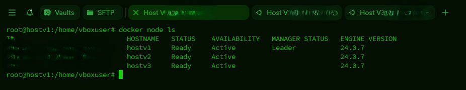
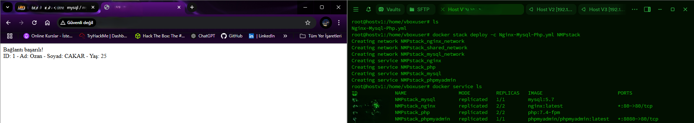

# Docker Swarm Yığını (Stack) - Nginx, PHP, MySQL ve phpMyAdmin

Bu depo, Docker Swarm kullanarak tam işlevsel bir web yığının dağıtımı için bir Docker Compose dosyası içermektedir. Yığın aşağıdaki bileşenleri kapsar:

- **Nginx**: Web sunucusu
- **PHP 7.4-FPM**: Backend işlemleri için
- **MySQL 5.7**: Veritabanı
- **phpMyAdmin**: Veritabanı yönetimi için

## Özellikler

- Docker Swarm ile çoklu replika desteği.
- Overlay ağ yapısı ile güvenli ağ izolasyonu.
- MySQL verisi için kalıcı depolama.

## Gereksinimler

1. [Docker](https://www.docker.com/) yükleyin.
2. Docker Swarm'ı başlatın:
   ```bash
   docker swarm init
   ```

## Kurulum

1. Bu depoyu klonlayın:

   ```bash
   git clone https://github.com/ozancakar/Docker-Swarm-Nginx-Php-Mysql-Project.git
   cd Docker-Swarm-Nginx-Php-Mysql-Project
   ```

2. Yığını dağıtın:

   ```bash
   docker stack deploy -c Nginx-Mysql-PhpMyAdmin.yml web_stack
   ```

3. Servisleri doğrulayın:

   ```bash
   docker service ls
   ```

   


1. Web uygulamasına erişim:

   - **Nginx**: [http://localhost](http://localhost)
   - **phpMyAdmin**: [http://localhost:8080](http://localhost:8080)


## Dizin Yapısı

```
.
├── docker-compose.yml   # Yığın için Docker Compose dosyası
├── html/                # Nginx tarafından sunulan HTML dosyaları (Kisiler adlı tabloyu ve içerisindekileri arar)
├── nginx.conf           # Nginx konfigürasyonu
├── my.cnf               # MySQL konfigürasyonu (Bazı TSL hatlarını ortadan kaldırır)
```

## Konfigürasyon

- **MySQL Ortam Değişkenleri:**
  `Nginx-Mysql-PhpMyAdmin.yml` dosyasındaki MySQL bilgileriniz güncelleyebilirsiniz:

  ```yaml
  environment:
    MYSQL_ROOT_PASSWORD: rootpassword
    MYSQL_DATABASE: mydb
    MYSQL_USER: user
    MYSQL_PASSWORD: password
  ```

  ** !!! Environment kısmı için .env dosyası oluşturup parola ve önemli bilgileri burda saklamanız en doğrusu olucaktır bu proje basit bir örnek ve öğretim amcacı taşıdığından dolayı bu tarz bir yol izlenmemiştir.

- **Volumes (Hacimler):**
  `html/`, `nginx.conf` ve `my.cnf` dosyalarının var olduğundan ve workerların ana dizininde bulunduğundan emin olun.

## Takip ve Gözetim

Stack durumunu takip etmek için kullanabileceğiniz komutlar:

- Swarm yüzerindeki tüm düğümleri listeleyin:

  ```bash
  docker node ls
  ```

  

- Çalışan servisleri görüntüleyin:

  ```bash
  docker service ls
  ```

  


## Temizlik

Yığını kaldırmak için:

```bash
docker stack rm web_stack
```

## Katkıda Bulunma

Bu depoyu fork edebilir, sorunlar bildirebilir ve pull request ile katkı sağlayabilirsiniz.

## Lisans

Bu proje MIT Lisansı ile lisanslanmıştır. Ayrıntılar için `LICENSE` dosyasını inceleyebilirsiniz.

